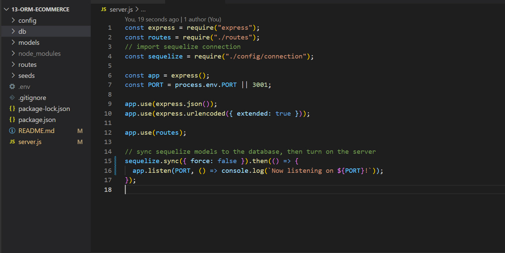

During week 13 of UTSA's Coding Bootcamp, we were given a directive of creating a E-commerce back end for an internet retail company because they want to use the lastest technologies. There were a number of requirements to meet, such as:

GIVEN a functional Express.js API
WHEN I add my database name, MySQL username, and MySQL password to an environment variable file
THEN I am able to connect to a database using Sequelize
WHEN I enter schema and seed commands
THEN a development database is created and is seeded with test data
WHEN I enter the command to invoke the application
THEN my server is started and the Sequelize models are synced to the MySQL database
WHEN I open API GET routes in Insomnia for categories, products, or tags
THEN the data for each of these routes is displayed in a formatted JSON
WHEN I test API POST, PUT, and DELETE routes in Insomnia
THEN I am able to successfully create, update, and delete data in my database

We were provided starter code from @Xandromus's coding bootcamp repo: https://github.com/coding-boot-camp/fantastic-umbrella. All other coding was done by me in VS Code and saved in GitHub. This project used ExpressJS, MySQL, Sequelize, dotenv, VSCode, GitHub, and Insomnia.

You can find my repo code here: https://github.com/amhernandez1163/13-orm-ecommerce
The YouTube DEMO can be found here: https://youtu.be/rYae7cAEuIk (resolution goes up to 720p - please adjust for quality)

